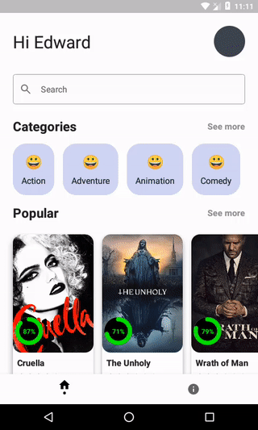

<p align="center">

</p>

* Native Lib app/src/main/cpp/native-lib.cpp

```c++
#include <jni.h>
#include <string>

extern "C" JNIEXPORT jstring
JNICALL
Java_com_github_psm_moviedb_utils_Keys_TMDBApiKey(JNIEnv *env) {
    std::string tmdb_api_key = "Your Api Key";
    return env->NewStringUTF(tmdb_api_key.c_str());
}
```
* lottie Loading https://lottiefiles.com/890-loading-animation#